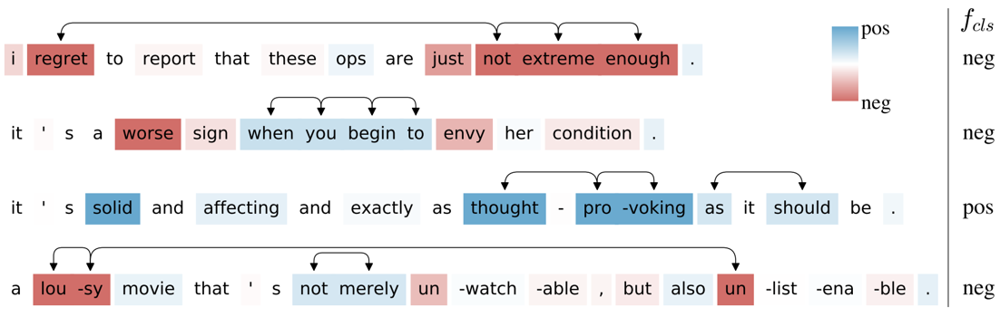
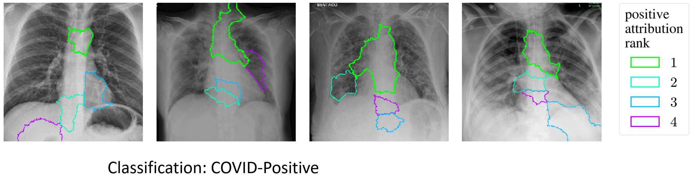
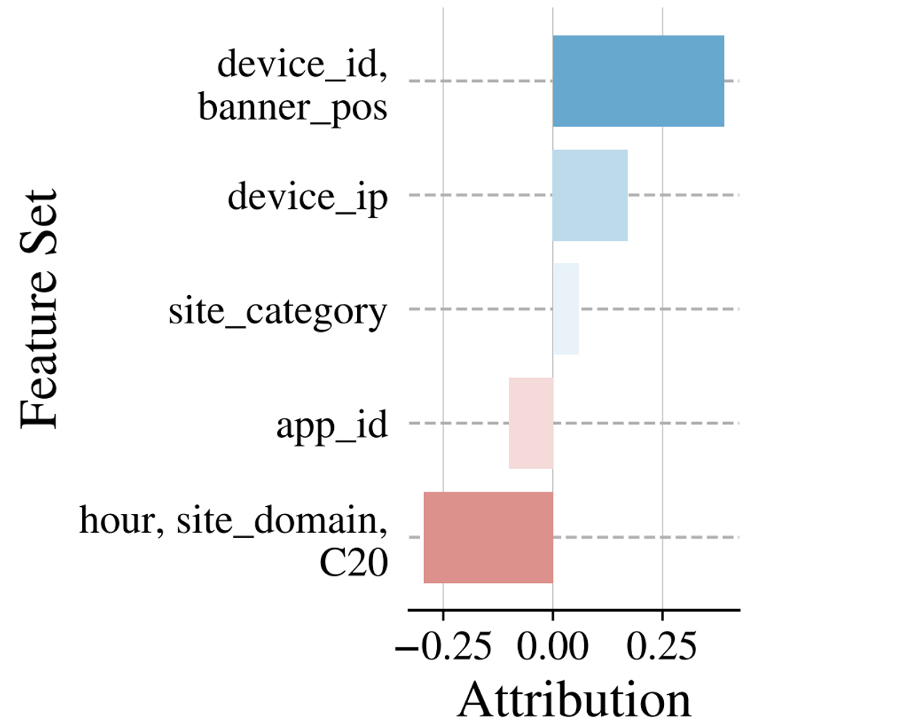
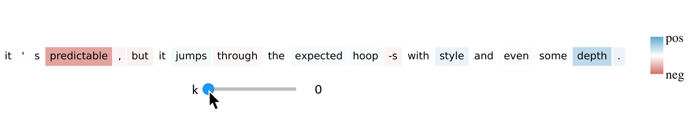

# Archipelago

Feature interactions affect predictions and our understanding of prediction models. Archipelago is an **interpretable**, **model-agnostic**, **scalable**, and **axiomatic** method for explaining the feature interactions (and individual feature effects) learned by prediction models. For interpretability, Archipelago is designed to provide **coherent**, **simple**, **general**, and **accurate** explanations.

Archipelago consists of two components:
1. ArchAttribute for analyzing feature interactions via interpretable attribution
2. ArchDetect for efficiently detecting said interactions

Examples of Archipelago explanations are shown below:

- - - -

<p align="center">

</p>

On sentiment analysis of random test sentences, the arrows here indicate interactions and colors indicate sentiment. We can assess the sensibility of these interactions based on our understanding of the English language.

- - - -

<p align="center">

</p>
Interactions can reveal conistent behavior between predictions. Here we see that a COVID-19 detection model tends to focus on the great-vessel region near the heart for COVID-positive detections.

- - - -

<p align="center">

</p>

Interactions can also reveal how digital recommendations are targeted to us. Here, an ad-recommendation system targets a digital ad to the device_id of a user based on the ad’s banner position.

- - - -


For details about Archipelago, please see our [NeurIPS 2020 paper](https://arxiv.org/pdf/2006.10965.pdf). 


## Requirements
* Python 3
* Numpy

Archipelago is model-agnostic in the sense that it doesn't depend on any specific model or modeling framework. 
Our demos and experiments do have specific requirements however, which are detailed in respective folders.

Note: a GPU is recommended for Deep Learning applications. 

## Quick Demo Setup
1. Run the following command
```bash
sh setup_demos.sh
```
2. Open and run the Jupyter notebook at ```demos/1. text analysis/demo_bert_torch.ipynb```


Here we notice the important lines of code.
```python
apgo = Archipelago(model_wrapper, data_xformer=xf, output_indices=class_idx)
apgo.explain(top_k=3)
```
```model_wrapper``` wraps a model and converts its inputs and outputs into numpy format. ```data_xformer``` performs any necessary data transformations.
<details><summary><b>Examples of model_wrapper and data_xformer</b></summary>

- A ```model_wrapper = BertWrapperTorch(model, device)``` object converts model inputs and outputs between the model's data format and numpy via ```__call__```. Here, ```batch_ids``` is a batch of id-basd feature vectors, where each id identifies a word token.
```python
import torch

class BertWrapperTorch:
    def __init__(self, model, device):
        self.model = model.to(device)
        self.device = device
        
    def get_predictions(self, batch_ids):
        batch_ids = torch.LongTensor(batch_ids).to(self.device)
        return self.model(batch_ids, None, None).data.cpu().numpy()

    def __call__(self, batch_ids):
        return self.get_predictions(batch_ids)
```
- ```data_xformer = TextXformer(input_ids, baseline_ids)``` simply maps data instance representations to original data formats via ```__call__```. Here, the original data format (```id_list```) is an id-based feature vector containing word token ids, similar to above.
```python
class TextXformer:
    def __init__(self, input_ids, baseline_ids):
        self.input = input_ids
        self.baseline = baseline_ids
        
    def simple_xform(self, instance_repr):
        mask_indices = np.argwhere(instance_repr==True).flatten()
        id_list = list(self.baseline)
        for i in mask_indices:
            id_list[i] = self.input[i]
        return id_list

    def __call__(self, instance_repr):
        return self.simple_xform(instance_repr)
```
</details>

 For simple explanations, ```top_k``` should be small relative to the number of features. To understand ```top_k```, see the next section.


## Interactive Visualization
1. Run the following commands
```bash
conda install -c conda-forge nodejs
sh setup_interactive_viz.sh

```
2. Open and run the Jupyter notebook at ```demos/1. text analysis/demo_bert_torch_interactive.ipynb```

We can interactively visualize Archipelago explanations by varying the ```top_k``` parameter introduced in the last section, as shown below:
<p align="center">

</p>

```k``` refers to an interaction strength threshold. Note that interactive visualization is relatively fast because interaction detection only runs once.

## Applications
Archipelago can explain any prediction model (even ones that don't learn interactions). In ```demos/```, demos are provided for Archipelago explanations of:
* sentiment analysis
* image classification
* digital recommendation
* COVID-19 detection from chest X-rays

## Experiments
Code is provided to reproduce the experiments of our [paper](https://arxiv.org/pdf/2006.10965.pdf).

1. Run the following command to setup experiments
```bash
sh setup_experiments.sh
```
2. Download the ImageNet '14 test set from [here](http://www.image-net.org/challenges/LSVRC/2014/) and place it in ```downloads/imagenet14/```
3. Experiments from the main paper can be run in the Jupyter notebooks at ```experiments/1. archdetect/``` and ```experiments/2. archattribute/```

More information about reproducibility is provided in ```experiments/README.md```.

## Pretrained Models and Data
All pretrained models and most data can be downloaded via ```python download.py --{quick_demo|demos|experiments|all}```. Note that the ```setup_*.sh``` scripts already do the download for you. 

## Todos
- [ ] Add more application demos.
 
 Feel free to make any requests.

## Citation
```
@inproceedings{tsang2020how,
  title={How does This Interaction Affect Me? Interpretable Attribution for Feature Interactions},
  author={Michael Tsang and Sirisha Rambhatla and Yan Liu},
  booktitle={Advances in Neural Information Processing Systems},
  year={2020},
}
```
